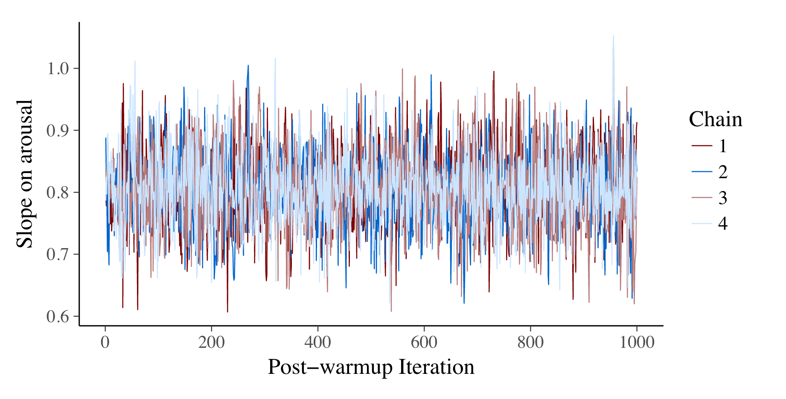

class: top


```{r setup, echo=FALSE, message = FALSE, warning = FALSE}
knitr::opts_chunk$set(
  echo = TRUE,
  fig.align = "center",
  message = FALSE,
  warning = FALSE,
  dev = "svg",
  out.width = "80%")

# next lines are to enable highlighting of R code

hook_source <- knitr::knit_hooks$get('source')
knitr::knit_hooks$set(source = function(x, options) {
  x <- stringr::str_replace(x, "^[[:blank:]]?([^*].+?)[[:blank:]]*#<<[[:blank:]]*$", "*\\1")
  hook_source(x, options)
})

options(knitr.table.format = "html")
options(knitr.kable.NA = '   ')

library(here)
library(knitr)
library(survey)
library(tidyverse)
library(broom)
library(cobalt)
library(WeightIt)
library(MatchIt)
library(xaringanthemer)
library(ggdag)
library(gapminder)
library(rstanarm)
library(ggpubr)

```


```{r xaringan-themer, include = FALSE}
style_mono_accent( 
  base_color = "#00539B",
  background_color = "#FFFFFF",
  code_font_size = ".8rem",
  extra_css = list("li" = list("padding" = "8px 0px 0px")))

```

##Data visualization
Earlier we stressed the importance of data visualization but can you guess the Pearson correlation coefficient and its associated p value?    

```{r echo=FALSE, out.width="40%"}
set.seed(123)        
age <- runif(100,35,60)
bp <- 110 +0.05*age + rnorm(100, 15)
df <- data.frame(age,bp)
mod <- lm( bp~age, df)
ggscatter(df, x = "age", y = "bp", 
          xlab = "age", ylab = "bp") +
  theme_bw()
```
 
--
.red[Pretty hard, eh]  
---
##Methods for correlation analyses

- .red[Pearson correlation (r)] - measures a **linear dependence** between two variables (x and y) when both are from **normal distribution** (to determine normality i) `shapiro.test()` ii) normality plot (`ggpubr::ggqqplot()`))       
- .red[Kendall tau] and .red[Spearman rho] are rank-based correlation coefficients (non-parametric test)     

Pearson correlation formula
$$r = \frac{\sum{(x-m_x)(y-m_y)}}{\sqrt{\sum{(x-m_x)^2}\sum{(y-m_y)^2}}}$$
where $m_x$ and $m_y$ are the means of x and y variables      
p-value of the correlation determined from the *t* value
$$t = \frac{r}{\sqrt{1-r^2}}\sqrt{n-2}  \;  \;   with \;\;  df = n-2 $$
 where n = number of observation in x and y variables     
 -1 < r < 1, no correlation r = 0

---
##Does this help?

```{r echo=FALSE, out.width="50%"}
ggpubr::ggscatter(df, x = "age", y = "bp", 
          xlab = "age", ylab = "bp") +
  geom_hline(yintercept = mean(bp), color="red") +
  geom_vline(xintercept = c(44,52), color="red") +
  geom_point(x=mean(age), y=mean(bp), color="blue", size=5) +
  theme_bw()
```
---
##Analytical solution
.pull-left[
Using `R` 
```{r}
set.seed(123)
age <- runif(100,35,60); bp <- 110 +0.05*age + rnorm(100, 15); df <- data.frame(age,bp)
cor.test(df$age, df$bp, method = "pearson") # cor.test(df$age, df$bp, method = "kendall"); cor.test(df$age, df$bp, method = "spearman")
```
]

.pull-right[
```{r echo=TRUE, out.width="80%"}
ggpubr::ggscatter(df, x = "age", y = "bp", add = "reg.line", conf.int = TRUE, 
    cor.coef = TRUE, cor.method = "pearson", xlab = "age", ylab = "bp") + theme_bw()       
```
]

---
##Linear regression
What's the relationship between slope in LR and Pearson's r?
$$\hat {\beta} = {\rm cor}(Y_i, X_i) \cdot \frac{ {\rm SD}(Y_i) }{ {\rm SD}(X_i) }$$
--
```{r}
# standardize x & y, can do manually or easier with scale function 
# perform LR with standardized data

df_std <- df %>% mutate(across(where(is.numeric), scale))
mod1 <- lm( bp~age, df_std); tidy(mod1)
```

.red[Once data is standardized then r = slope]
---

## What is your interpretation?


```{r fig.height=4, fig.align='center', echo=FALSE}
#### Simulate fake data
n <- 1000
# set the random seed to get reproducible results
# change the seed to experiment with variation due to random noise
set.seed(2243)
true_ability <- rnorm(n, 50, 10)
noise_1 <- rnorm(n, 0, 10)
noise_2 <- rnorm(n, 0, 10)
midterm <- true_ability + noise_1
final <- true_ability + noise_2               
exams <- data.frame(midterm, final)           
fit_1 <- stan_glm(final ~ midterm, data=exams, refresh = 0)
gg_reg_mean <- ggplot(exams,aes(midterm,final)) +
  geom_point() +
  labs(x="Midterm exam score", y="Final exam score") +
  geom_abline(intercept=coef(fit_1)[1], slope=coef(fit_1)[2], color="red") +
  scale_x_continuous( expand = c(0,0) , limits = c(0,100) )+
  scale_y_continuous( expand = c(0,0), limits = c(0,100) ) +
  theme_bw()
gg_reg_mean

```
--
One causal explanation:  

Better students score high on midterm and then get over confident for the final, while poorer students increase their studying for the final after a low midterm score
---
## Linrear regression (Bayesian)
.pull-left[

```{r echo=FALSE, out.width="60%"}
gg_reg_mean
```
The option `refresh = 0` suppresses the default Stan sampling progress output. For more complex models and bigger data, it can be
useful to see the progress.     
Note in `stan_glm` using the default weakly informative priors which can be seen with `prior_summary(model)`
]
.pull-right[
```{r echo=TRUE}
fit_1 <- stan_glm(final ~ midterm, data=exams, refresh = 0)
print(fit_1, digits=2)
```
]
---
## Priors
Priors are often viewed as the Achilles' heel of Bayesian analyses.    

My personal belief, they are a **strength** as they allow the incorporation of prior knowledge, are entirely transparent and are updated by the current data following the uncontested laws of probability.    

Bayesian analyses are sometimes done using **flat** or **non-informative** priors to allow final results to be completely dominated by the data.    

**This is rarely a good idea**   

For example, using the prior $\theta$ = N(0, $\sigma$ = 500) produces some strange beliefs

---
## Prior - N(0,500)

Let's do some simulations


```{r, echo=TRUE}
theta <- rnorm(1e5, mean = 0, sd = 500)
p_approx <- mean(abs(theta) < 250)
print(paste("Pr(-250 < theta < 250) =", round(p_approx, 2)))
```


```{r, echo=TRUE}
d <- data.frame(theta, clr = abs(theta) > 250)
library(ggplot2)
g <- ggplot(d, aes(x = theta, fill = clr)) +
  geom_histogram(binwidth = 5, show.legend = FALSE) +
  scale_y_continuous(name = "", labels = NULL, expand = c(0,0)) +
  scale_x_continuous(name = expression(theta), breaks = c(-1000, -250, 250, 1000))
```

---
## Prior - N(0,500)
```{r, echo=FALSE, out.width="20%"}
g
```

Very hard to imagine how this could represent anyone's serious prior beliefs, yet non-informative priors remain in use.      

Some amount of prior information will be available. For example, even if there is nothing to suggest a priori that a particular coefficient will be positive or negative, there is almost always enough information to suggest that different orders of magnitude are not equally likely. Making use of this information when setting a prior scale parameter is simple — one heuristic is to set the scale an order of magnitude bigger than you suspect it to be— and has the added benefit of helping to stabilize computations.     

These **vague** priors are the default priors in most packages.

---

## Same results with OLS

Since there are 1,000 data points the priors contribute very little and give the same numerical results as standard linrear regression with `lm` function


```{r echo=TRUE}
fit_2 <- lm(final ~ midterm, data=exams)
print(fit_2, digits=2)
```

---
## Plot results

.pull-left[
```{r echo=TRUE,  eval=FALSE}
ggplot(exams,aes(midterm,final)) +
  geom_point() +
  labs(x="Midterm exam score", y="Final exam score") +
  geom_abline(intercept=coef(fit_1)[1], slope=coef(fit_1)[2], color="red") +
  scale_x_continuous( expand = c(0,0) , limits = c(0,100) )+
  scale_y_continuous( expand = c(0,0), limits = c(0,100) ) +
  theme_bw()
```
]
.pull-right[
```{r echo=FALSE}
ggplot(exams,aes(midterm,final)) +
  geom_point() +
  labs(x="Midterm exam score", y="Final exam score") +
  geom_abline(intercept=coef(fit_1)[1], slope=coef(fit_1)[2], color="red") +
  scale_x_continuous( expand = c(0,0) , limits = c(0,100) )+
  scale_y_continuous( expand = c(0,0), limits = c(0,100) ) +
  theme_bw()
```
]

---
## Data generating process

- Data was simulated    
- No association between midterm and final variables   
- Both = function(true ability, a random variable, and a noise component)   

```{r echo=TRUE}
#### Simulate fake data
n <- 1000
# set the random seed to get reproducible results
# change the seed to experiment with variation due to random noise
set.seed(2243)
true_ability <- rnorm(n, 50, 10)
noise_1 <- rnorm(n, 0, 10)
noise_2 <- rnorm(n, 0, 10)
midterm <- true_ability + noise_1         #<<
final <- true_ability + noise_2           #<<
exams <- data.frame(midterm, final)
```
<br>    
**Interpretation: Regression to the mean**  
.red[Emphasizes need to separate statistical and causal models]

---
##Four key steps for Bayesian modeling

Guide for the fundamentals of both single-level and hierarchical linear regression modeling      

Will generally use **Stan** and front end `rstanarm` package (`brms` is good alternative)    
<br>    
Detailed vignettes can be found [here](http://mc-stan.org/rstanarm/articles/)

- **Step 1** Specify the data model and prior  - .red[Prior * likelihood] $\propto$ .red[posterior]         
- S**tep 2** Estimate the model parameters  - Bayes theorem typically involves using a numerical algorithm
to draw a representative sample from the posterior distribution         
- **Step 3** Check sampling quality and model fit  - Graphical and numerical checks are necessary of fails go back to Step 1   
- **Step 4** Summarize, interpret results - Make posterior predictions    
<br>    
For some simple models, analytical (closed-form ) solutions are possible    
Almost all non-trivial models the full posterior has to be approximated numerically by sampling (simulating draws)  based on Monte Carlo principle
---
##Assessing convergence

Check whether the chains converge to the same area    
Recommended convergence checks include monitoring the $\hat{R}$ statistic and visual checks        
$\hat{R}$ (also referred to as the potential scale reduction factor) is based on comparing the variation between the chains to the variation within the chains      
If all chains converge $\hat{R}$ will be close to 1 and  < 1.1   


```{r out.width="60%", echo=FALSE}

```

The four chains appear to be the same except for noise with no discernible pattern, a strong sign of convergence

---
## `stan_glm` modeling in four steps
**Step 0.** Install software and prepare data      
The data is available in this excellent [tutorial](https://www.tqmp.org/RegularArticles/vol14-2/p099/p099.pdf) and essentially examines the relationship between 2 continuous variables **valence** (sensation of pleasantness) and **arousal** in 20 individuals measured at 14 time points

```{r echo=TRUE}
# install.packages(c("rstanarm", "bayesplot", "ggplot2", "broom")) 
library("rstanarm") 
library("bayesplot") 
library("ggplot2") 
library("broom")

# note: the line below to run chains in parallel (saves time)
options(mc.cores = parallel::detectCores())
rstan::rstan_options(auto_write = TRUE)

# default plotting theme
theme_set(bayesplot::theme_default(base_size = 15))

#load data from https://www.tqmp.org/RegularArticles/vol14-2/p099/p099.pdf
dat <- read.csv(here("data", "sampledata.csv"), header=TRUE) 

```

---
##Step 1. Specify the model
Usual linear regression form    
$$y_i = \beta_0 + \beta_1 * X_i + \epsilon_i    \;and \;  \epsilon_i \sim N(0, \sigma^2)$$     
Equivalent Bayesian form     
$$y_i \sim N(\beta_0 + \beta_1 * X_i, \sigma^2)$$
<br>    
`stan_glm` syntax is same as `lm` syntax with first part of the call specifying the outcome and predictors.   
Unless the ‘family’ argument is specified, `stan_glm` assumes that the likelihood is normal (Gaussian) with an identity link function   

```{r echo=TRUE}
SingleLevelModel <- stan_glm( valence ~ arousal, data = dat, refresh=0)

```

The default priors are weakly informative andmay be seen with `prior_summary()`       
Informative priors may be used if available
---
##Step 2. Estimate the model parameters

By default, `rstanarm `uses four Markov chains with 2000 iterations each, half of which are discarded as “warm-up”.    
<br>    
A warm-up sampling phase is used to give the algorithm time to find the target posterior area      
<br>     
Defaults may be modified using the `chains `and `iter` arguments  (may be needed if problems of convergnce i.e n_eff > 1000)      

```{r echo=TRUE}
# Example of adapting priors and sampler settings 
SingleLevelModelMod <- stan_glm( valence ~ arousal,data = dat, 
                        prior = normal(0,1,autoscale=FALSE), 
                        prior_intercept=normal(50,100, autoscale=FALSE), 
                        iter = 4000, adapt_delta = 0.99, refresh=0)
```

---
##Step 3. Check sampling quality

```{r echo=TRUE}
summarySingleLevelModel <- summary(SingleLevelModel,probs = c(0.025, 0.975)); print(summarySingleLevelModel)
```
---
##Step 3. Check sampling quality
- 3 quantities related to the performance of the sampler: Monte Carlo standard error (MCSE), $\hat{R}$ and effective sample size (n_eff)    
- **Visual check**      
- **Posterior predictive checks**
 Can also explore the posterior with with `shinystan::launch_shinystan(SingleLevelModel)`

```{r echo=TRUE, out.width="30%"}
plot(SingleLevelModel, "trace", pars = "arousal")
```

---
##Step 4. Summarize and interpret results
.small[Summary information with `SingleLevelModel$stan_summary`]
```{r}
SingleLevelModel$stan_summary
```
.small[Extract posterior draws from fitted model for specific questions -> e.g. P(slope >x) (e.g 0.7)]
```{r}
posteriorSamples <- as.matrix(SingleLevelModel, pars = "arousal"); mean(posteriorSamples > 0.7)
```
.small[Posterior probability slope coefficient > 0.7 is about 96% ]     

---
##Posterior predictive checks 
Compare the observed data to datasets simulated according to our assumed data generating process and the posterior draws of the model parameters. 

```{r echo=TRUE, out.width="35%"}
pp_check(SingleLevelModel, nreps = 100) + xlab("valence")
```

Draws from the posterior predictive distribution (thin light blue lines) and the observed data (thick dark blue line) have similar distributions     


---
##Posterior predictive checks
Predictive plot of  **Y** (valence) & **X** (arousal) link. Dark regression line  = posterior mean estimate of the intercept and slope (β1 ≈ 0.8). Blue regression lines are computed from a random subset of the posterior draws of these two parameters  and shows the associated uncertainty.

```{r echo=FALSE, out.width="60%", out.width="30%"}
###### Figure 6: plotting regression lines ##
##########################################
# Extract the (post-warmup) posterior draws
posterior1 <- as.matrix(SingleLevelModel)
colnames(posterior1)
means1 <- colMeans(posterior1)

# Take random 100 posterior draws of intercept and slope
# 100 isn't special, but enough to show uncertainty without
# making the graph unreadable
betas <- posterior1[sample(nrow(posterior1), 100), 1:2]


# Plot regression lines implied by the betas
blues <- bayesplot::color_scheme_get("brightblue")
mod1p1 <- ggplot(dat, aes(x = arousal, y = valence)) +
  geom_point(color = "gray30") +
  geom_abline(
    intercept = betas[, 1], 
    slope = betas[, 2],
    color = blues[[2]], 
    size = 0.15, 
    alpha = 0.5
  ) +
  geom_abline(
    intercept = means1[1], 
    slope = means1[2],
    size = 1.25, 
    color = blues[[6]]
  ) +
  ylim(0, 100)

plot(mod1p1)
```


Limitation: measures are not independent 20 individuals measured at 14 time points
---

## Understanding simple regression models 
Estimating the mean is the same as regressing on a constant term 
.pull-left[
Generate some fake data & calculate the mean and std error
```{r echo=TRUE}
set.seed(12345)
n_0 <- 20  
y_0 <- rnorm(n_0, 2.0, 5.0)  
fake_0 <- data.frame(y_0)  
mean(fake_0$y_0)
sd(fake_0$y_0)/sqrt(n_0)

```
]
.pull-right[
Regression on a constant term 
```{r echo=TRUE, message=FALSE}
fit_0 <- stan_glm(y_0 ~ 1, data=fake_0,  prior_intercept=NULL, prior=NULL, prior_aux=NULL, refresh =0); print(fit_0) 
```
]
---
## Estimating a difference = regressing on an indicator variable  
Add new group: 30 observations from N(8.0, 5.0) 
.pull-left[
Calculate the mean difference & std error
```{r echo=TRUE}
set.seed(12345)
n_1 <- 30;  y_1 <- rnorm(n_1, 8.0, 5.0) 
diff <- mean(y_1) - mean(y_0)  
se_0 <- sd(y_0)/sqrt(n_0)  
se_1 <- sd(y_1)/sqrt(n_1)  
se <- sqrt(se_0^2 + se_1^2)  
print(c(diff, se))

```
6.01for the difference and 1.27 for its standard  error is consistent with the construction of our simulations in which the true population  difference was 6.0
]
.pull-right[
Regression with indicator variable
```{r echo=TRUE, message=FALSE}
n <- n_0 + n_1; y <- c(y_0, y_1);  x <- c(rep(0, n_0), rep(1, n_1))  
fake <- data.frame(x, y)  
fit <- stan_glm(y ~ x, data=fake, prior_intercept=NULL, prior=NULL, prior_aux=NULL, refresh = 0); print(fit) 
```
The estimate of the slope, 6.9, is identical to the difference in means, $\bar{y_1} − \bar{y_0}$ and    
the intercept (2.4) = $\bar{y_0}$
]
---
## Visual equivalence

```{r fig.align='center', fig.height=3}
par(mar=c(3,3,3,2), mgp=c(1.7,.5,0), tck=-.01)
plot(x, y, xlab="Indicator, x", ylab="y", bty="l", xaxt="n", main="Regression on an indicator is the same\nas computing a difference in means",  pch=19, cex=.5)
axis(1, c(0, 1)); abline(h=mean(y[x==0]), lty=2, col="gray50"); abline(h=mean(y[x==1]), lty=2, col="gray50"); abline(coef(fit)[1], coef(fit)[2])
text(.5, -1 + coef(fit)[1] + .5*coef(fit)[2], paste("y =", arm::fround(coef(fit)[1], 2), "+", arm::fround(coef(fit)[2], 2), "x"),cex=.9,adj=0); text(.05, -1 + mean(y[x==0]), expression(paste(bar(y)[0], " = 2.41")), col="gray30", cex=.9, adj=0)
text(.95, 1 + mean(y[x==1]), expression(paste(bar(y)[1], " = 9.22")), col="gray30", cex=.9, adj=1)
```

For binary indicator, slope is simply the average difference in the outcome between the two groups     
For continuous variable estimated slope is a weighted average of slopes for every possible pair of 2 points ($n^2$)
---
## Credibility or compatibility intervals
In Bayesian inference often speak of uncertainty intervals, credibility or compatibility intervals to distinguish from frequentist confidence intervals   
68% confidence interval for slope = median +/- mad_sd (standard deviation of mean absolute deviation) = 6.6 +/- 1.4 = [5.2 - 8.0]    

This can also be calculated by extracting the simulations from the posterior distribution
```{r echo=TRUE}
sims <- as.matrix(fit)  
paste0("68% credible interval ", round(quantile(sims[,"x"], c(0.16, 0.84)),2))
paste0("95% credible interval ", round(quantile(sims[,"x"], c(0.025, 0.975)),2)) 

```

---
# Gapminder example

Lets create a dataset from the `gapminder` package.       
Filter the dataset to a more visually manageable number of data points
```{r echo=TRUE}
library(gapminder)
data(gapminder)
dat <- filter(gapminder, continent=="Asia" & year==2007 & pop<50000000) %>% #select sample
  mutate(fitted=lm(lifeExp~gdpPercap)$fitted) # added predicted values

```

---

# Plot

.pull-left[
```{r }
g <- ggplot(dat, aes(gdpPercap, lifeExp)) +
  geom_point() +
  geom_point(aes(x=mean(gdpPercap), y=mean(lifeExp)), colour="red", size=5) +
  geom_smooth(method='lm', se=FALSE) +
  geom_segment(aes(x = gdpPercap, y = lifeExp,
                   xend = gdpPercap, yend = fitted)) +
  ggtitle("Life expectancy vs GDP in Asian countries\n (with populations < 50 million)") +
  theme_bw()

```
]

.pull-right[
```{r echo=FALSE, fig.height=8}
g
```
]


What is the $\color{red}{\text{red}}$ point?

---

# Bayesian approach

```{r}
library(rstanarm)
dat$gdpPercap <- dat$gdpPercap / 1000
fit_1 <- stan_glm(lifeExp~gdpPercap, data=dat, refresh=0)
print(fit_1, digits=4)  
```
What does this mean?
---
# Interpretation
The fitted model is  lifeExp = 64.7 + 0.4 ∗ gdpPercap + error.     
The residual standard deviation, sigma = 6.7,  indicates that lifeExp  will be within ± 6.7 of the linear predictor for about 68% of the data points and will be within  ± 2 ∗ 6.7 = 13.4 of the predictor approximately 95% of the time (cf normal distribution)    

We get an estimating the proportion of variance explained, as 1 minus the  proportion of variance unexplained     
$$R^2 = 1 - \frac{\sigma^2_{fit\_1}}{sd(lifeExp)^2} = 0.44$$
meaning that the linear model accounts for 44% of the variance in lifeExp in these data.

It is inappropriate to say “the **effect**" of $1000 gdpPercap increase on lifeExp is 0.4 years as this suggests an individual causal effect which is not estimated  the model of this  observational data, that richer populations have higher life expectancy on average. These data  allow between-population comparisons or predictions, but do not  speak to causal within-person effects.  

---

# Summary

To summarize: regression is a mathematical tool for making predictions.     

Regression coefficients  can sometimes be interpreted as effects, but they can always be interpreted as average comparisons. 