```{r setup, echo=FALSE, message = FALSE, warning = FALSE}
knitr::opts_chunk$set(
  echo = FALSE,
  eval = TRUE,
  fig.align = "center",
  fig.asp = 0.618,
  fig.retina = 3,
  fig.width = 6,
  message = FALSE,
  warning = FALSE,
  dev = "svg",
  out.width = "80%")

options(knitr.table.format = "html")
options(knitr.kable.NA = '   ')

library(here)
library(knitr)
library(broom)
library(cobalt)
library(WeightIt)
library(MatchIt)
library(xaringanthemer)
library(tidymodels)
library(openintro)
library(ggridges)
library(tidyverse)  # For ggplot2 and friends
library(patchwork)  # For combining plots
library(ggdag)      # For making DAGs with ggplot
library(dagitty)    # For dealing with DAG math
library(latex2exp)  # Easily convert LaTeX into arcane plotmath expressions
library(ggtext)     # Use markdown in ggplot labels 
set.seed(1000)

```


```{r xaringan-themer, include = FALSE}
style_mono_accent( 
  base_color = "#00539B",
  background_color = "#FFFFFF",
  code_font_size = ".8rem",
  extra_css = list("li" = list("padding" = "8px 0px 0px")))

```

##Data visualizations   
Data Visualizations can…      
  
• help understand basic concepts     
• help understand your data      
• clarify your story for others     
• emphasize a message     
• build trust with your audience      
• inform / influence their decisions      

```{r out.width="70%"}
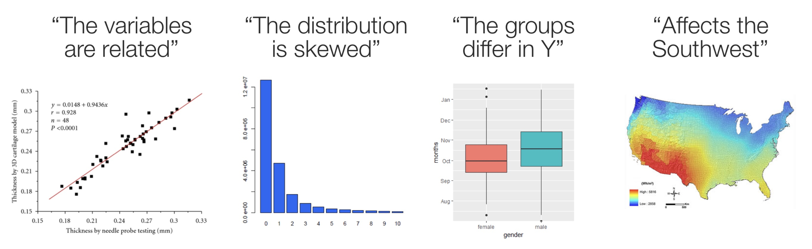
```
--
.Large[.red[Poor data visualizations can do the opposite!]]
---
##Would you trust these authors?

Even if they come from **National Institutes of Health, Bethesda, MD, USA**
<br>   
```{r out.width="50%"}
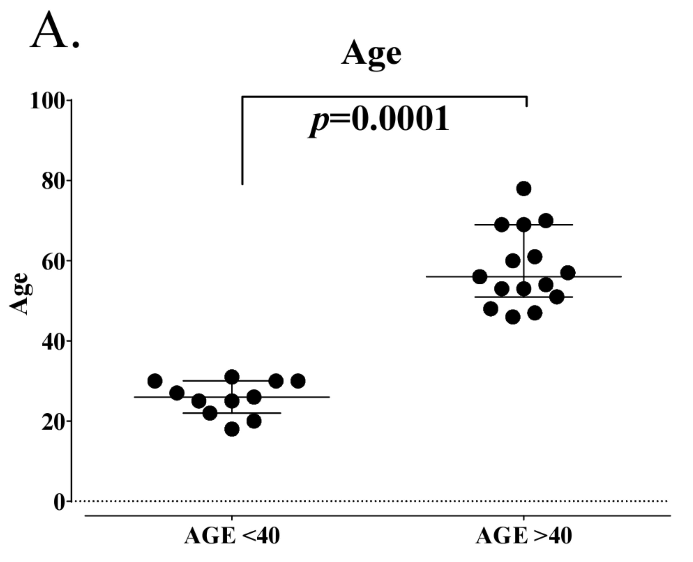
```
<br>    
Reference: [doi.org/10.5772/62322](https://journals.aboutscience.eu/index.php/jcb/article/view/2071)
---
##Classic visualizations
.pull-left[
The best statistical graphic ever drawn - [Edward Tufte](https://en.wikipedia.org/wiki/Edward_Tufte) 
```{r out.width="100%"}
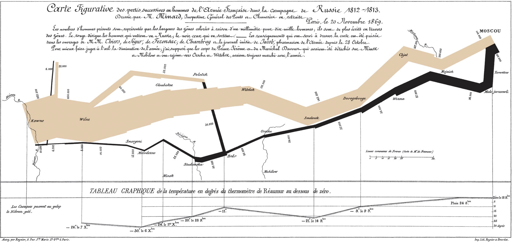
```
- 6 types of information: geography, time, temperature,  course, direction of the army's movement, # of troops remaining     
- "C’est la Bérézina!"]
.pull-right[
Nightingale's Rose
```{r out.width="100%"}
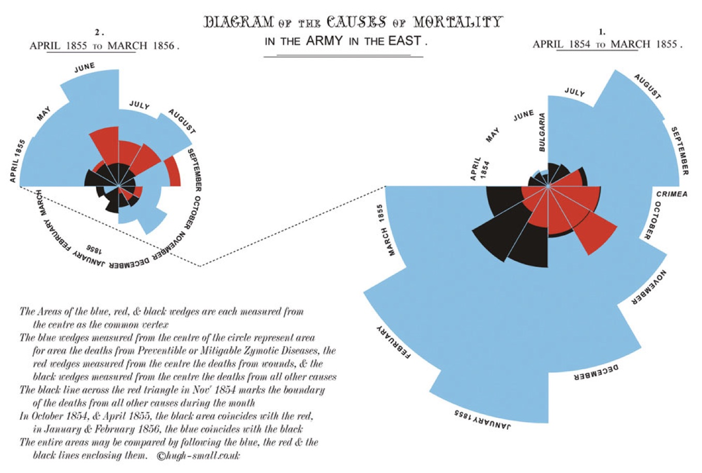
```
- Although remembered as the mother of modern nursing, Nightingale was an accomplished statistician      
- 1st female fellow of the Royal Statistical Society
]

---
##Another classic visualization
.pull-left[
John Snow and the “Ghost Map”
```{r out.width="80%"}
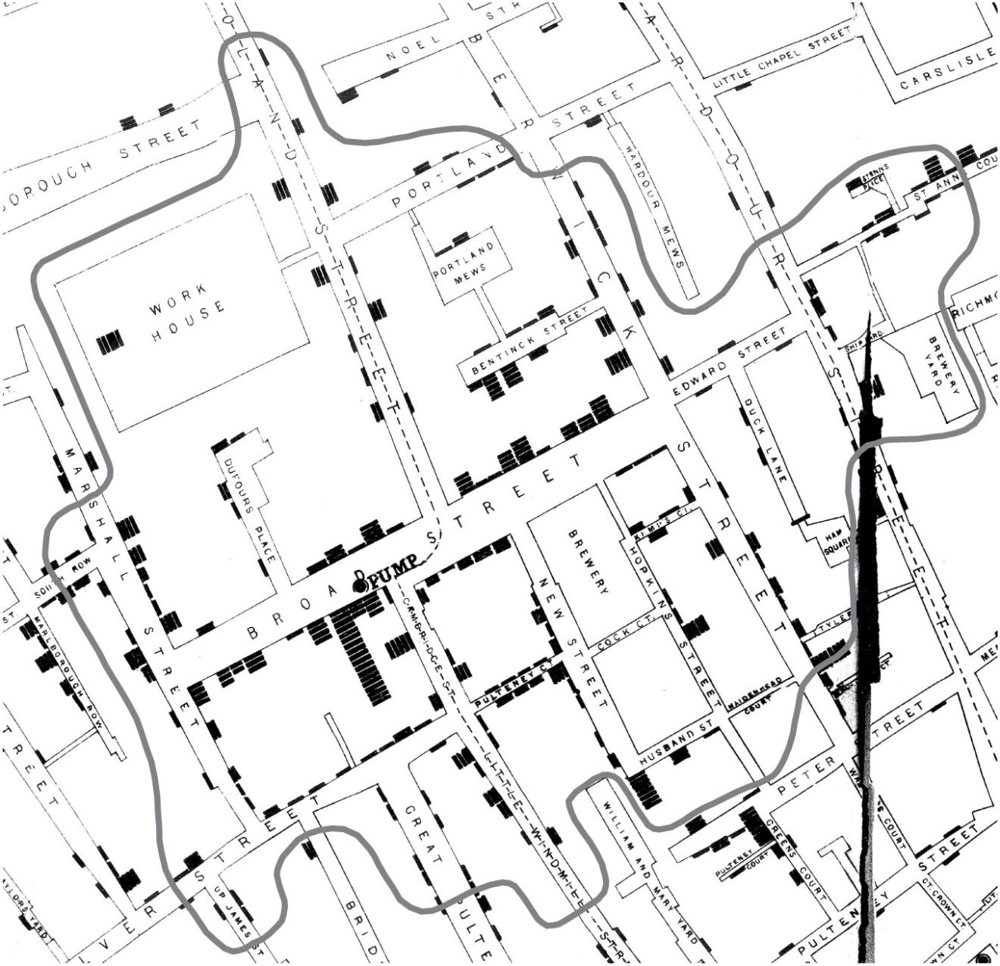
```
]
.pull-right[
John Snow and the “Ghost Map”    
(updated with Goggle maps & `R`)
```{r out.width="100%"}
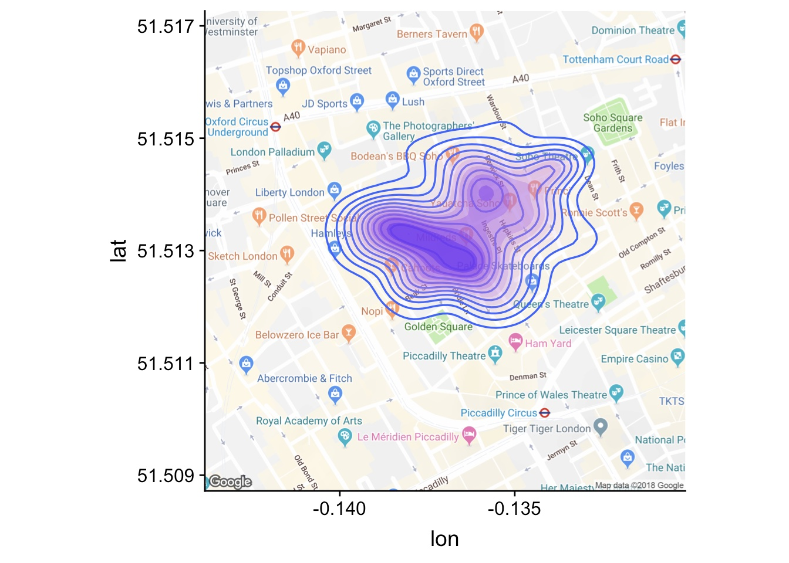
```

]
.small[Reference: [The Ghost Map: The Story of London's Most Terrifying Epidemic--and How It Changed Science, Cities, and the Modern World](https://www.amazon.ca/dp/B003QTD4T6/ref=dp-kindle-redirect?_encoding=UTF8&btkr=1)]
---
##Any more doubts?
Modern approach - watch [Hans Rosling](https://www.youtube.com/watch?v=Z8t4k0Q8e8Y)

```{r out.width="80%"}
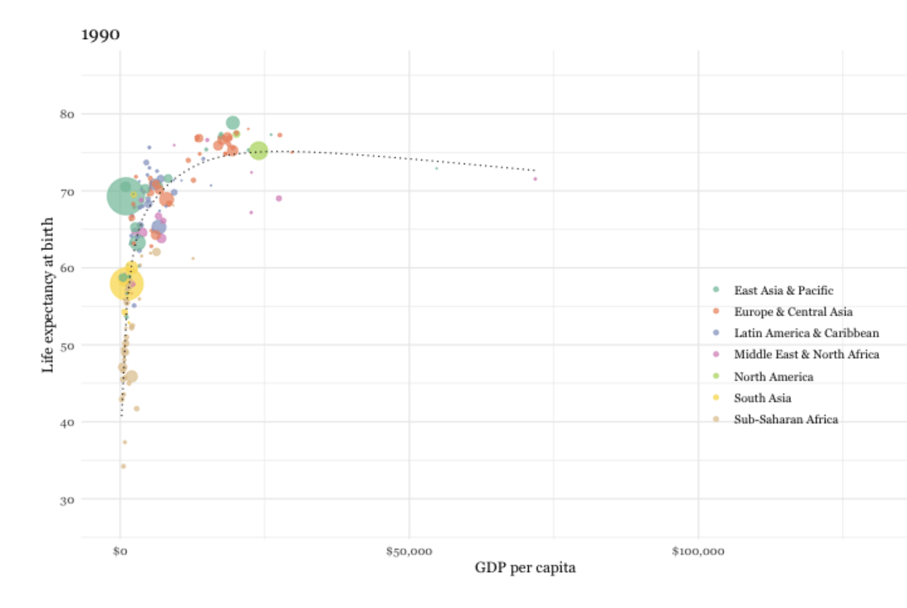
```

---
##Uninspired visualization (barplot)

Generate some data

.pull-left[
```{r echo=TRUE}
set.seed(2021)
data <- tibble(
    group = factor(c(rep("Group 1", 100), rep("Group 2", 250), rep("Group 3", 25))),
    value = c(## Group 1
        seq(0, 20, length.out = 100),
        ## Group 2
        c(rep(0, 5), rnorm(30, 2, .1), rnorm(90, 5.4, .1), rnorm(90, 14.6, .1), rnorm(30, 18, .1), rep(20, 5)),
        ## Group 3
        rep(seq(0, 20, length.out = 5), 5))
) %>% 
    rowwise() %>%
    mutate(value = if_else(group == "Group 2", value + rnorm(1, 0, .4), value))

```

]
.pull-right[
<span style="color:red">Barplots </span>  are often used to display and summarize the data but are <span style="color:red">uninspired </span> 
```{r echo=TRUE}
ggplot(data, aes(x=group, y=value)) + geom_bar(stat='summary') + geom_errorbar(stat='summary', width=.2) + 
      ylab("Average value") + scale_y_continuous(name="Group",breaks = seq(0, 15, by = 5))
```

]
---
##Semi-inspired visualization (boxplot)


.pull-left[
<span style="color:red">Boxplots </span>  are a marginal improvement over barplots in that they show the median, IQR and outliers but are still <span style="color:red">uninspired </span> 
```{r echo=TRUE}
gg1 <- ggplot(data, aes(x = group, y = value)) + geom_boxplot(fill = "grey92")
gg1
```

]
.pull-right[
.red[Big improvement adds the data points]
```{r echo=TRUE}
gg1 + geom_point(## draw bigger points
    size = 2, ## add some transparency
    alpha = .3, ## add some jittering
    position = position_jitter(## control randomness and range of jitter
      seed = 1, width = .2))
```

]
---
##Violin plots
<span style="color:red">Violin </span> plots enable one to see the distribution of the data

```{r echo=TRUE}
ggplot(data, aes(x = group, y = value)) +
  geom_violin(fill = "grey92")
```
---
##Inspirational visualization
<span style="color:red">Rainclouds </span>  build on the combined violin / boxplot by adding the raw data as well from [Cederic Scherer's amazing  blog](https://www.cedricscherer.com/2021/06/06/visualizing-distributions-with-raincloud-plots-and-how-to-create-them-with-ggplot2/)
.pull-left[
```{r echo=TRUE}
gg2 <- ggplot(data, aes(x = group, y = value)) + ## add half-violin from {ggdist} package
  ggdist::stat_halfeye(## custom bandwidth
    adjust = .5, ## adjust height
    width = .6, ## move geom to the right
    justification = -.2, ## remove slab interval
    .width = 0, 
    point_colour = NA
  ) + 
  geom_boxplot(
    width = .12, ## remove outliers
    outlier.color = NA ## `outlier.shape = NA` works as well
  ) + ## add dot plots from {ggdist} package
  ggdist::stat_dots(## orientation to the left
    side = "left", ## move geom to the left
    justification = 1.1, ## adjust grouping (binning) of observations 
    binwidth = .25) + ## remove white space on the left
  coord_cartesian(xlim = c(1.2, NA))
```
]
.pull-right[
```{r out.width="150%"}
gg2 
```
]
---
##Raincloud Example #2
.pull-left[
```{r echo=TRUE}
gg3 <- ggplot(data, aes(x = group, y = value)) + 
  ggdist::stat_halfeye(
    adjust = .5,
    width = .6, ## set slab interval to show IQR and 95% data range
    .width = c(.5, .95)
  ) + 
  ggdist::stat_dots(
    side = "left", 
    dotsize = .8, 
    justification = 1.05, 
    binwidth = .3
  ) +
  coord_cartesian(xlim = c(1.2, NA))
```
]
.pull-right[
```{r out.width="150%"}
gg3 
```
]
---
##Raincloud Example #3
.pull-left[
```{r echo=TRUE}
gg4 <- ggplot(data, aes(x = group, y = value)) + 
  ggdist::stat_halfeye(
    adjust = .5, width = .6, .width = 0, 
    justification = -.3, point_colour = NA) + 
  geom_boxplot(
    width = .25, outlier.shape = NA) +
  geom_point(
    size = 1.3,
    alpha = .3,
    position = position_jitter(seed = 1, width = .1)
  ) + 
  coord_cartesian(xlim = c(1.2, NA), clip = "off")
```
]
.pull-right[
```{r out.width="150%"}
gg4
```
]
---
##Quick tutorial for ggplot2
There are many terrific sources for tutorials and examples for `ggplot`     
One example is found [here](https://www.cedricscherer.com/2019/08/05/a-ggplot2-tutorial-for-beautiful-plotting-in-r/)     
<br>   


```{r echo=TRUE}

chic <- readr::read_csv("data/chic.csv") # read data set - weather in Chicago
g <- ggplot(chic, aes(x = date, y = temp)) + #set data and axes
  geom_point(color = "firebrick") + # add color, could also change "shape" and "size"
  labs(x = "Year", y = "Temperature (°F)", 
       title = "Temperatures in Chicago",
       subtitle = "Seasonal pattern of daily temperatures from 1997 to 2001", 
       caption = "Data: NMMAPS", 
       tag = "Fig. 1") + # title, labels, etc
  theme(axis.text.x = element_text(angle = 50, vjust = 1, hjust = 1, size = 12)) + # rotate axis
  theme_bw() # change the  theme (background, etc)
```
---
##Quick tutorial for ggplot2
```{r}
g
```
---
##Quick tutorial for ggplot2
Can code the plot based on season, i.e. map the variable season to the aesthetic color      
`ggplot(chic, aes(x = date, y = temp, color = season)) +`

```{r}
ggplot(chic, aes(x = date, y = temp, color = season)) + #set data and axes
  geom_point() + # points
  labs(x = "Year", y = "Temperature (°F)", title = "Temperatures in Chicago",
       subtitle = "Seasonal pattern of daily temperatures from 1997 to 2001", caption = "Data: NMMAPS", tag = "Fig. 1") + # title, labels, etc
  theme(axis.text.x = element_text(angle = 50, vjust = 1, hjust = 1, size = 12)) + # change the the theme (background, etc)
  theme_bw()
```

---
##Graphical understanding of confounding
.pull-left[
```{r echo=TRUE}
#Generate some data
set.seed(123)
df <- data.frame(W = as.integer((1:200>100))) %>%
  mutate(X = .5+2*W + rnorm(200)) %>%
  mutate(Y = -.5*X + 4*W + 1 + rnorm(200),time="1") %>%
  group_by(W) %>%
  mutate(mean_X=mean(X),mean_Y=mean(Y)) %>%
  ungroup()

g <- ggplot(df, aes(x=X,y=Y)) + geom_point() + #basic plot x vs y raw data + regression line
  geom_smooth(method=lm) + ggtitle("Scatterplot of raw data & simple linear regression line") +
  theme_bw()
```

]

.pull-right[
```{r out.width="100%"}
g
```
]
<br>    
--
.Large[.red[But the dataset includes another variable **W** that affects **X** and **Y**]]
---
##Multiple regression


```{r echo=TRUE}
mod <- lm(Y ~ X + W, data = df) 
summary(mod)
```
.red[Notice slope of X parameter is now negative, was positive in previous graph]
---
##Graphical explanation of confounding
.pull-left[
```{r echo=TRUE}
# basic plot x vs y + linear regression + stratifying on confounder
g1 <- ggplot(df, aes(x=X, y=Y, color=as.factor(W))) + 
  geom_point() +
  ggthemes::scale_color_colorblind() +
  geom_smooth(method=lm) +
  ggtitle("Scatterplot with LR stratifying on confounder")

#Remove differences in X explained by W
g2 <- df %>% mutate(X = X - mean_X,mean_X=0,mean_Y=NA,time="Remove differences in X explained by W") %>%
  ggplot(aes(y=Y,x=X,color=as.factor(W))) + 
  geom_point() +
  geom_vline(aes(xintercept=mean_X,color=as.factor(W))) +
  ggthemes::scale_color_colorblind() +
  ggtitle("Remove differences in X explained by W")


```
]
.pull-right[
```{r}
g1
g2

```
]
---
##Graphical explanation of confounding
.pull-left[
```{r echo=TRUE}
#Remove differences in Y explained by W
g3 <- df %>% mutate(X = X - mean_X,Y = Y - mean_Y,mean_X=NA,mean_Y=0,time="5. Remove differences in Y explained by W") %>%
  ggplot(aes(y=Y,x=X,color=as.factor(W))) + 
  geom_point() +
  geom_hline(aes(yintercept=mean_Y,color=as.factor(W))) +
  ggthemes::scale_color_colorblind() + 
  guides(color=guide_legend(title="W")) +
  ggtitle("Remove differences in Y explained by W")

#Centered regression line
g4 <- df %>% mutate(X = X - mean_X,Y = Y - mean_Y,mean_X=NA,mean_Y=0,time="5. Remove differences in Y explained by W") %>%
  ggplot(aes(y=Y,x=X,color=as.factor(W))) + 
  geom_point() +
  geom_hline(aes(yintercept=mean_Y,color=as.factor(W))) +
  ggthemes::scale_color_colorblind() + 
  guides(color=guide_legend(title="W")) +
  ggtitle("Centered regression line") +
  geom_abline(intercept = 0, slope = mod$coefficients[2])

```
]

.pull-right[
```{r}
g3
g4
```
]

.red[Slope of this graph (-0.05) = parameter estimate of multiple LR]
---
##Don't get fooled

.pull-left[
US counties with the highest 10% age-standardized death rates for kidney cancer, 1980–1989    
Hypotheses?    
<br>
```{r out.width="100%"}
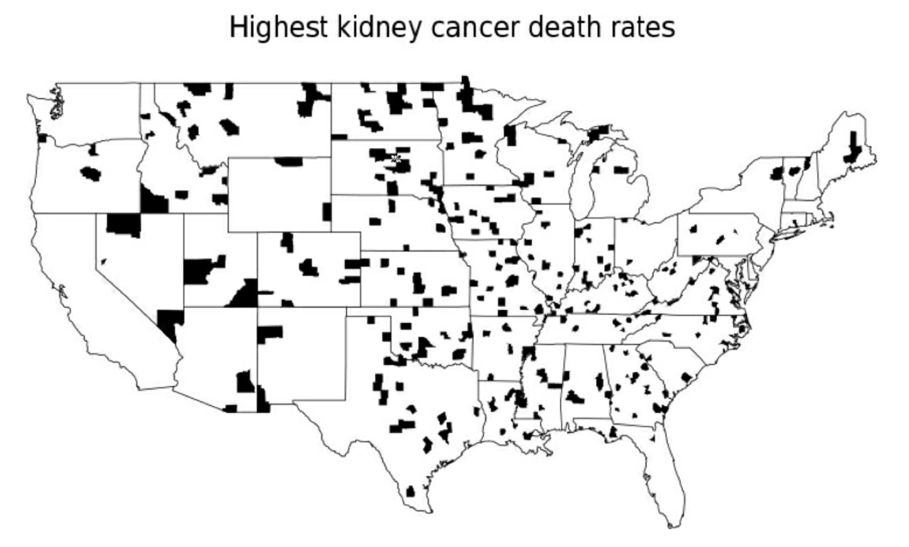
```
]
--
.pull-right[
US counties with the lowest 10% age-standardized death rates for kidney cancer, 1980–1989       
Hypotheses?    
<br>
```{r out.width="100%"}
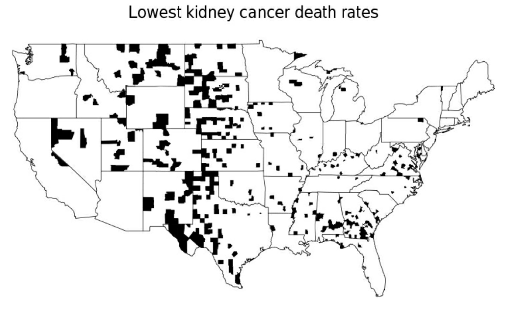
```
]

.small[Reference: Gelman, Andrew. Teaching Statistics (p. 14). OUP Oxford. Kindle Edition] 
---
##Variability of small numbers!

In a county with 100 people: if 1 kidney cancer death in 1980s, -> 1 / 1000 per decade, among the highest rates    
If no kidney cancer deaths,  rate will be lowest     
Observed rates for smaller counties are much more variable, even if the true cancer probability in these counties is nothing special, probably random fluctuation      
If a large county has a very high rate, more likely a real phenomenon     
--
<br>    
.large[.red[One Solution]]     
<br>    
**Bayes-estimated county rate** - a weighted average of (a) the observed rate in the county and (b) the national average rate.     
Weights proportional to the population of the county     
Counties with extremely small population the rate is shrunk virtually to the national average    
Counties with moderate population the rate is shrunk part way toward the national average    
Large counties the adjusted rate is essentially equivalent to the observed rate

---
##Exploratory data analysis (EDA) 

.red[Question:] What is the natural variability in hs-troponin values       
• Individual, group and time variability -> complex analytical (mixed or hierarchical) models
--
<br>     
```{r out.width="100%"}
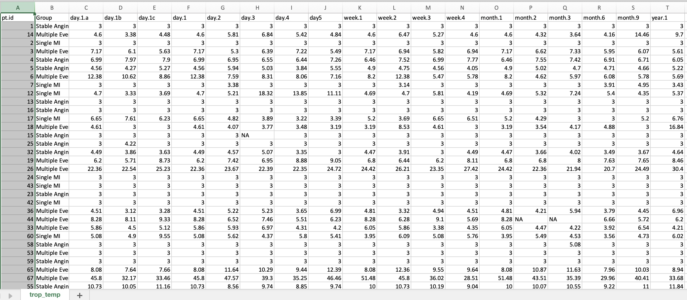
```
---
##Exploratory data analysis (EDA) 

.red[Question:] What is the natural variability in hs-troponin values    
<br>    
```{r out.width="100%"}
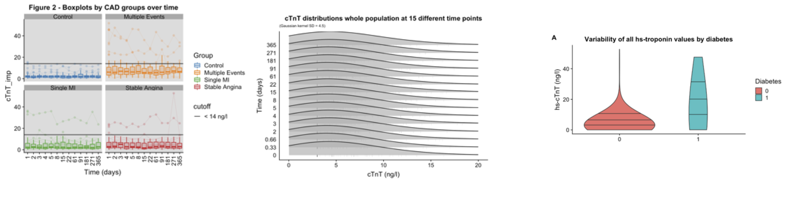
```
--
.red[Answer:] EDA provides much information to answer the question     
• hs troponins do not vary over time    
• hs-troponins are higher in CAD than normals     
• variability of hs-troponins increased in specific subgroups     
• one size fits all threshold level doesn’t seem appropriate     

**Analytical methods (hierarchical models) -> more precision but less transparency**
---
##Deceptive graphs
```{r out.width="200%"}
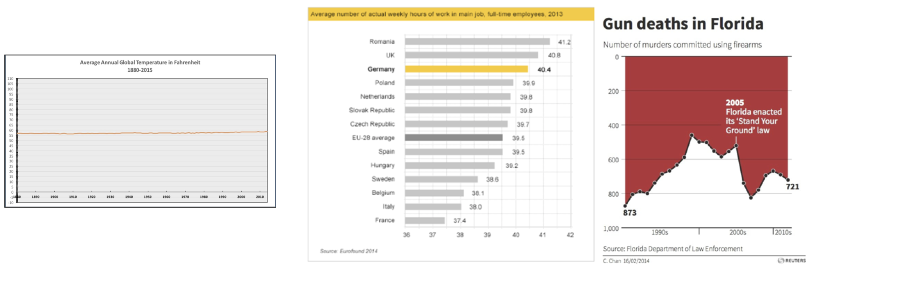
```

---
##Deceptive graphs
```{r out.width="200%"}
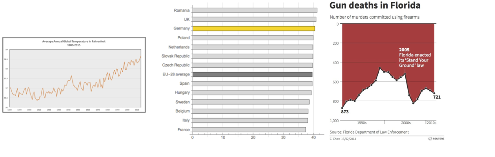
```

Remember [Hanlon's razor](https://en.wikipedia.org/wiki/Hanlon%27s_razor)    
.red[Never attribute to malice that which can be adequately explained by stupidity]

